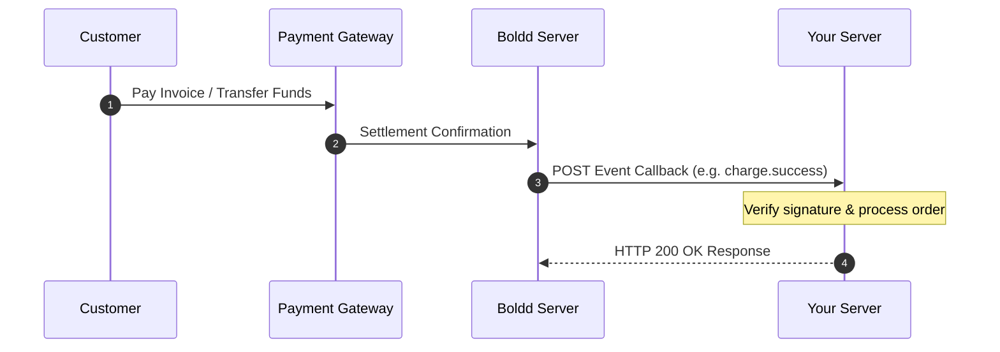

# Webhook Notifications

#### Webhook Sequence Flow



You can configure a webhook endpoint to be notified in real time about events on your Boldd account - payments received, refunds, virtual card issuance, and more.

#### Setting Up a Webhook

1. Log in to your Boldd Dashboard and open **Settings → Developers**.
2. Fill in your webhook URL and save.
3. Send yourself a test event to confirm you're receiving the JSON body and responding correctly.

Your endpoint must acknowledge each event with an HTTP `200 OK`. If it doesn't, Boldd treats the attempt as failed and retries for the next **48 hours at 30-minute intervals** until a `200 OK` is received.

#### Event Types

| Event          | Description                                                         |
| -------------- | ------------------------------------------------------------------- |
| `TRANSACTIONS` | A customer successfully paid you via payment link, API, or a plugin |
| `REFUND`       | A refund was issued for a customer's payment                        |

#### Identifying the Transaction Type

Check the **`paid_through`** field on the webhook payload to know what kind of transaction triggered it:

| `paid_through` value | Meaning                                          |
| -------------------- | ------------------------------------------------ |
| `dedicatedAccount`   | Payment into a virtual account / dedicated NUBAN |
| `paylink`            | Payment via checkout / payment link              |
| `virtualcard`        | Virtual card creation event                      |

#### Sample Payload

```json
{
  "event_type": "transactions",
  "data": {
    "trans_status": "06",
    "message": "Successful",
    "transmode": "live",
    "feeby": "split",
    "reference": "1B6579758742351347",
    "TransDetails": {
      "transref": "1B6579758742351347",
      "clientref": "",
      "amountpaid": "10000.00",
      "amount_settled": "9950.00",
      "fee": "50.00",
      "currency": "NGN",
      "transtoken": "de2ec4d82c7c15da23c39fc6a6f42",
      "previous_bal": "100000.00",
      "new_bal": "19950.00",
      "payment_channel": "",
      "payment_time": "Sat, 16 Jul 2022",
      "redirect_url": "",
      "transmsg": ""
    },
    "CustomerDetails": {
      "customer_name": "John Doe",
      "customer_email": "johndoe@example.com",
      "customer_phone": "0701234567"
    },
    "transerror": 0,
    "paid_through": "paylink",
    "isflagged": "0"
  }
}
```

#### Notification History

Every webhook attempt is logged and retrievable, which is useful if you need to inspect or debug a delivery.

**Endpoint**

<mark style="color:blue;">`GET`</mark> `{{base_url}}/webhookevents.php` (or `POST {{base_url}}/webhookevents`)

Every outbound business webhook sent through the shared webhook sender is persisted in `transhook`. You can fetch the exact copy of what was sent along with the provider response.

**Request Headers**

| Header          | Type     | Required | Description                                             |
| --------------- | -------- | -------- | ------------------------------------------------------- |
| `Authorization` | `String` | Yes      | Bearer token authentication (`Bearer YOUR_SECRET_KEY`). |




```bash
curl --location '{{base_url}}/webhookevents' \
--header 'Authorization: Bearer YOUR_SECRET_KEY' \
--header 'Content-Type: application/json'
```





```javascript
const response = await fetch('{{base_url}}/webhookevents', {
  method: 'POST',
  headers: {
    'Authorization': 'Bearer YOUR_SECRET_KEY',
    'Content-Type': 'application/json'
  }
});
const data = await response.json();
```





```javascript
const axios = require('axios');
let data = JSON.stringify({{base_url}});

let config = {
  method: 'post',
  maxBodyLength: Infinity,
  url: '{{base_url}}/webhookevents',
  headers: { 
    'Authorization': 'Bearer YOUR_SECRET_KEY',
    'Content-Type': 'application/json'
  },
  data : data
};

axios.request(config)
.then((response) => {
  console.log(JSON.stringify(response.data));
})
.catch((error) => {
  console.log(error);
});
```





```python
import requests
import json

url = "{{base_url}}/webhookevents"

payload = '{{base_url}}'
headers = {
  'Authorization': 'Bearer YOUR_SECRET_KEY',
  'Content-Type': 'application/json'
}

response = requests.request("POST", url, headers=headers, data=payload)

print(response.text)
```





```php
$curl = curl_init();

curl_setopt_array($curl, array(
  CURLOPT_URL => '{{base_url}}/webhookevents',
  CURLOPT_RETURNTRANSFER => true,
  CURLOPT_ENCODING => '',
  CURLOPT_MAXREDIRS => 10,
  CURLOPT_TIMEOUT => 0,
  CURLOPT_FOLLOWLOCATION => true,
  CURLOPT_HTTP_VERSION => CURL_HTTP_VERSION_1_1,
  CURLOPT_CUSTOMREQUEST => 'POST',
  CURLOPT_POSTFIELDS =>'{{base_url}}',
  CURLOPT_HTTPHEADER => array(
    'Authorization: Bearer YOUR_SECRET_KEY',
    'Content-Type: application/json'
  ),
));

$response = curl_exec($curl);

curl_close($curl);
echo $response;
```





```dart
var headers = {
  'Authorization': 'Bearer YOUR_SECRET_KEY',
  'Content-Type': 'application/json'
};
var request = http.Request('POST', Uri.parse('{{base_url}}/webhookevents'));
request.body = '{{base_url}}';
request.headers.addAll(headers);

http.StreamedResponse response = await request.send();

if (response.statusCode == 200) {
  print(await response.stream.bytesToString());
}
else {
  print(response.reasonPhrase);
}
```




#### Sample response


```json
{
  "status": true,
  "msg": "Notifications Retrieved",
  "data": [
    {
      "event_type": "transactions",
      "request_time": "Sat 12-Oct-2024 01:27 pm",
      "response_time": "Sat 12-Oct-2024 01:45 pm",
      "reqtimeago": "1 month, 2 days, 22 hours, 38 minutes, 9 seconds ago",
      "reference": "IB19CD17287K705WUSD",
      "requestbody": {
        "event_type": "transactions",
        "event_status": "success",
        "paid_through": "virtualcard",
        "type": "virtualcard_issuance",
        "trans_status": "01",
        "card_holder": "John Doe",
        "amount_charged": 12,
        "currency": "USD"
      },
      "respbody": "",
      "resphttpcode": "0",
      "canrepush": true
    }
  ]
}
```


Each record includes a `canrepush` flag — if `true`, you can use **Repush Notification** to trigger re-delivery of that specific event.


**Review:** `Notification History` (`/webhookevents`) isn't currently a named page in the sidebar. Recommend adding it as a sibling page next to Webhook Notifications and Repush Notification — it's a genuinely useful, fully-documented endpoint that would otherwise have nowhere to live.

